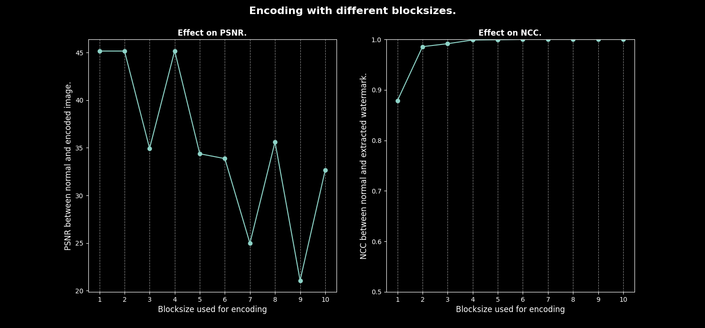

# Image Watermarking
---

A block-based watermarking algorithm for images using bit planes is a method that embeds a watermark into an image by manipulating the bit planes of the image blocks. The steps involved in this process are

1. **Image Division**: The original image is divided into non-overlapping blocks of equal size.

2. **Bit Plane Extraction**: For each block, the bit planes are extracted. A bit plane of an image is a set of bits corresponding to a bit position in each of the binary numbers representing the image.

3. **Watermark Embedding**: The watermark is embedded into the selected bit planes of the image blocks. This involves modifying the bits of each pixel in the selected bit planes.

4. **Image Reconstruction**: The blocks are then recombined to form the watermarked image.

This method provides robustness against common image processing operations and maintains the quality of the original image. The watermark can be used for various purposes such as copyright protection or content authentication.

## Results
---




## Usage
---
```bash
python3 marker.py -i imgs/barbara256.png -w watermarks/10.png -b 2 -p 2
```

```bash
usage: marker.py [-h] -i IMAGE_PATH -w WATERMARK_PATH [-o RESULT_PATH] [-p {1,2,3,4,5,6,7,8}] [-b {1,2,3,4,5,6,7,8,9,10}]

options:
  -h, --help            show this help message and exit
  -i IMAGE_PATH, --image_path IMAGE_PATH
                        Path for the image to be watermarked.
  -w WATERMARK_PATH, --watermark_path WATERMARK_PATH
                        Path for the watermark.
  -o RESULT_PATH, --result_path RESULT_PATH
                        Directory where watermarked image needs to be stored.
  -p {1,2,3,4,5,6,7,8}, --plane {1,2,3,4,5,6,7,8}
                        Plane at which encoding is to be done.
  -b {1,2,3,4,5,6,7,8,9,10}, --block_size {1,2,3,4,5,6,7,8,9,10}
                        Block size with which encoding is to be done.
```
## Test
---
```bash
python3 tester.py -i imgs/ -w watermarks/ --param blocksize --noise_type SnP --strength 0.1 --type_of_test complete
```

```bash
usage: tester.py [-h] -i IMAGE_DIR -w WATERMARK_DIR [-o RESULT_PATH] [-n {Gaussian,SnP}] [-s [STRENGTH ...]]
                 [-t {single,unit,complete}] [-p {planes,blocksize,both}]

options:
  -h, --help            show this help message and exit
  -i IMAGE_DIR, --image_dir IMAGE_DIR
                        Directory of test images
  -w WATERMARK_DIR, --watermark_dir WATERMARK_DIR
                        Directory of test watermarks
  -o RESULT_PATH, --result_path RESULT_PATH
                        Directory where resulting graph needs to be written.
  -n {Gaussian,SnP}, --noise_type {Gaussian,SnP}
                        Type of noise to be tested under.
  -s [STRENGTH ...], --strength [STRENGTH ...]
                        Strength of noise used.
  -t {single,unit,complete}, --type_of_test {single,unit,complete}
                        Type of test to be conducted (over all images or one single image).
  -p {planes,blocksize,both}, --param {planes,blocksize,both}
                        Which parameters to be tested.
```
